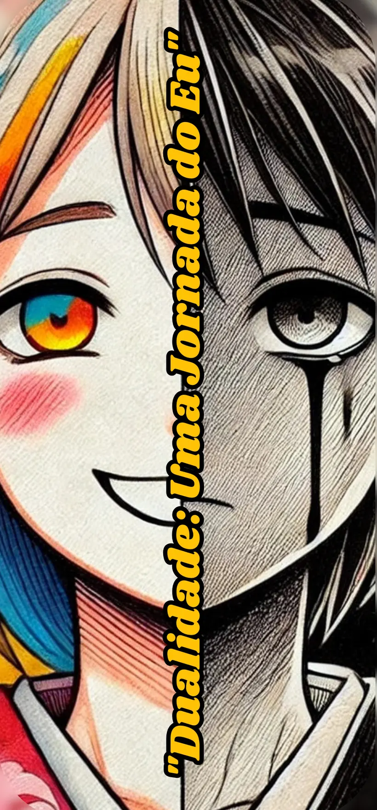

  

<h1 align="center">Dualidade: Uma Jornada do Eu</h1>

  <em>Duas cidades. Um espelho. Uma pergunta que só você pode responder.</em>

  RPG psicológico · RPG Maker MV · em desenvolvimento

---

## A história

Reflex tem 20 anos e vive na Cidade da Luz — vibrante, organizada,
aparentemente perfeita. Só que os dias se repetem, as pessoas se cumprimentam
sem se olhar nos olhos, e um vazio silencioso cresce dentro dele, sem nome e
sem explicação. A cidade continua funcionando como um relógio enquanto a
vitalidade vai embora aos poucos, consumida por uma apatia que ninguém nomeia.

Pistas enigmáticas deixadas por uma recém-chegada chamada Max levam Reflex até
a Cidade das Sombras: o espelho distorcido da Luz, caótica e degradada, em
crepúsculo permanente — e mais viva do que a Luz conseguiu ser. Ali as emoções
não têm filtro. A raiva, o medo e a culpa continuam ocupando os prédios que a
Luz demoliu.

Para entender por que sente que "nada importa", Reflex vai ter que atravessar
os dois mundos e conviver com o que cada um deles guarda. A travessia nunca é
magia nem teletransporte — é sempre metáfora psicológica. E, quanto mais ele
atravessa, mais difícil fica sustentar a ideia de que as duas cidades são,
afinal, lugares.

## As duas cidades

| | Cidade da Luz | Cidade das Sombras |
| --- | --- | --- |
| **Registro** | Fachada — o que Reflex mostra | Reprimido — o que Reflex engoliu |
| **Clima** | Dia permanente | Crepúsculo permanente |
| **Mapa-chave** | Praça da Harmonia | Praça Fraturada |
| **Aliado** | Lyra | Erebus |

## Elenco

- **Reflex** — 20 anos. Pesadelos recorrentes e um vazio que ele não sabe
  nomear. É o único que atravessa, e cada travessia cobra alguma coisa.
- **Max** — recém-chegada, a única que enxerga a dualidade que todo mundo
  escolheu ignorar. Não guia Reflex pela mão: abre a porta e segue seu caminho.
- **Lyra** — companheira da Luz. Otimista por fora, insegura por dentro.
  Defende que a Luz pode ser salva, mesmo tendo parado de acreditar nisso.
- **Erebus** — companheiro das Sombras. Carrega a raiva de quem foi ignorado
  tempo demais. Para ele a Luz é a mentira, e integrar os dois lados é covardia.
- **A Entidade das Perguntas** — nem vilã, nem aliada. Um espelho que fala e
  não aceita silêncio como resposta.

Não há romance. É decisão de projeto: Max é catalisadora, e Lyra e Erebus são
partes de Reflex antes de serem companheiros.

## A Entidade das Perguntas

Em cada transição entre os mundos, uma presença neutra apresenta a Reflex uma
situação específica do passado dele — e faz uma pergunta direta. Não existe
resposta certa e não existe pontuação visível. Cada escolha altera diálogos
futuros, o estado emocional de Reflex e o final do jogo. A Entidade nunca
comenta a resposta: devolve o silêncio e desaparece até a próxima travessia.

> "Tem coisas que não voltam — pessoas, versões de você mesmo, oportunidades.
> Você consegue construir algo novo sem precisar que o antigo retorne?"

- Consigo. O novo não apaga o que foi real.
- Ainda não. Perder parece que foi culpa minha.
- Talvez. Mas preciso de mais tempo.

Nenhuma das três é penalizada. Adiar também é uma resposta.

## Os cinco atos

| | Ato | Temas |
| --- | --- | --- |
| I | O Despertar | desconexão · apatia · curiosidade |
| II | A Desordem | contraste · emoções reprimidas · esperança · raiva |
| III | O Confronto Interior | medo · culpa · sacrifício |
| IV | A Revelação | aceitação · perdão · transformação |
| V | O Renascimento | equilíbrio · resiliência · esperança renovada |

A ordem importa: cada ato só faz sentido depois do anterior ter cobrado seu
preço.

## Histórias à margem

Oito sidequests espalhadas pelas duas cidades. Nenhuma é obrigatória e nenhuma
dá equipamento — o que elas devolvem é contexto, e às vezes um pedaço da
vitalidade que a Cidade da Luz vem perdendo.

- **A Canção Silenciosa** — um músico perdeu a vontade de tocar.
- **A Pintura Esquecida** — uma tela sem assinatura e um artista que desistiu
  de ser visto.
- **O Mistério das Cartas Perdidas** — cartas que nunca chegaram ao destino.
- **O Refúgio dos Gatos** — três gatos sumidos e uma mulher que só quer cuidar
  de alguma coisa.
- **O Espelho da Verdade** — reflete o que você esconde, não o que aparenta.
- **A Chave dos Enigmas** — enigmas nas duas cidades abrem uma área secreta.
- **A Árvore da Esperança** — uma árvore-símbolo definhando devagar.
- **A Lenda dos Sussurros Noturnos** — uma figura que só aparece à noite.

## Ficha técnica

| | |
| --- | --- |
| **Gênero** | RPG narrativo psicológico |
| **Motor** | RPG Maker MV |
| **Plataforma** | PC · demais a definir |
| **Idioma** | Português (BR) · outros a definir |
| **Estrutura** | 5 atos + 8 sidequests |
| **Romance** | Nenhum |
| **Combate** | Não confirmado |
| **Inspirações** | OMORI · Life is Strange |
| **Lançamento** | Sem data · desenvolvimento independente |

## Estado

Desenvolvimento independente, em andamento. Ainda não existe build jogável.

- **Roteiro** — Ato I escrito em prosa; estrutura dos cinco atos fechada, atos
  II–V em sinopse.
- **Sidequests** — os 8 roteiros escritos. *O Refúgio dos Gatos* é a primeira a
  virar evento no MV.
- **Mapas** — Praça da Harmonia e Praça Fraturada em construção.
- **Arte** — key art definida; direção de arte in-game em aberto.
- **Áudio** — não iniciado.

## Saiba mais

- [Página do jogo](https://luwey-silva.github.io/Reflex/) — sinopse, cidades,
  elenco, atos e a mecânica das perguntas, com a Entidade jogável.
- [`docs/DUALIDADE.md`](docs/DUALIDADE.md) — o material de trabalho completo,
  incluindo as decisões que ainda faltam.

## Licença

MIT © 2026 Luwey Da Silva
